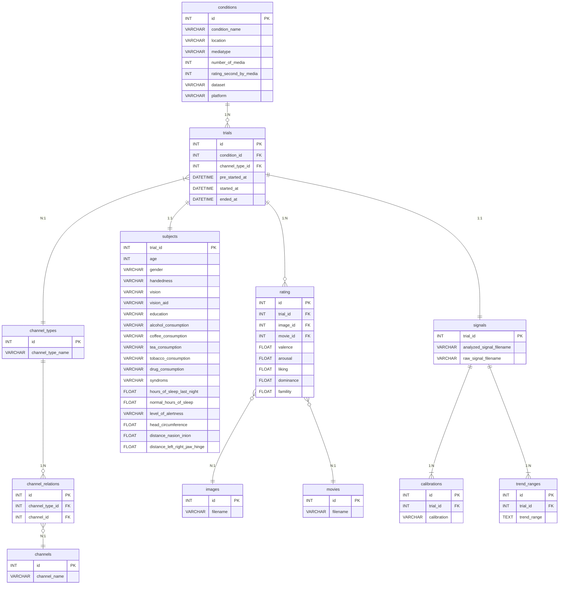

# MERS 　-Media Emotion Rating System-
<div align="center">
    
</div>

## 目次
1. [Overview](#Overview)
2. [Technologies](#Technologies)
3. [Environments](#Environments)
4. [Usage](#Usage)
5. [ER Diagram](#ER)


## Overview

This application is designed to evaluate the emotions of participants when they view media and to create a dataset for analyzing the relationship between media and emotions.


## Technologies

Backend: 

Frontend: 

Database: 

Container: 

## Environments

### Code Generation

1.If you haven't installed the code generation tools

To generate a customized openapi-generator jar file, install Maven as follows:

- MacOS：`brew install maven`
- Other OS: https://maven.apache.org/install.html

Additionally, to run the generated jar file and create the schema, set up a Java runtime environment.

- Java Download: https://www.java.com/ja/download/

2.If the code generation tools are already installed

Execute the following code to generate the jar file. This command skips the compilation of test code and the execution of tests.

```bash
make create-jar
```

Execute the following code to generate the schema using openapi-generator. Currently, it generates only the structure of models, requests, and responses.

```bash
make generate
```

### Dependency Installation

Run the following command in the frontend directory:

```bash
npm install --frozen-lockfile
```

Run the following command in the backend directory:

```bash
npm install --frozen-lockfile
```
## Usage
### How to activate the application

Run the following command in the root directory of MERS to build and start the Docker containers.

#### Production Environment

```bash
make build-up prod
```

After startup, access 192.168.10.127:4000 to conduct experiments. For detailed settings of the production environment, refer to MERS Documents.

#### Development Environment

```bash
make build-up dev
```

After startup, access http://localhost:4000 to check the operation.

### How to deactivate the application

Run the following command in the root directory of MERS to delete and stop the Docker containers.

#### Production Environment

```bash
make stop prod
```

#### Development Environment

```bash
make stop dev
```

## ER Diagram

The database schema is illustrated in the following diagram.


