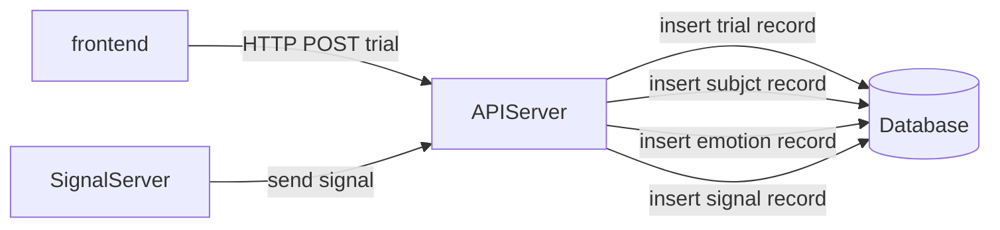
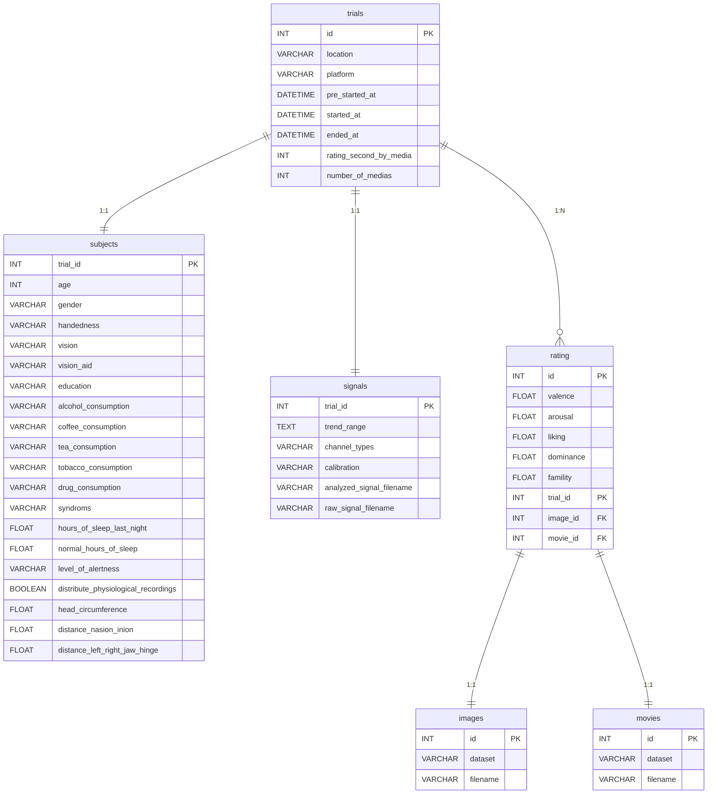

# MERS　-Media Emotion Rating System-
## 概要
本アプリケーションは、被験者がメディアを視聴した時の感情を評価し、メディアと感情の関係性を分析するためのデータセットを作成する。


## 使用技術
Backend:  

Frontend: 

Database: 

Container: 

# 使用にあたって
## 操作方法
### アプリケーションの起動
MERSディレクトリ直下で、以下のコマンドを実行してDockerコンテナのビルドと起動をする。
#### 本番環境
```bash
make build-up prod
```

#### 開発環境
```bash
make build-up dev
```

起動後に`192.168.10.127:4000` にアクセスして実験を行う。  
frontendアプリケーションのbuildに時間がかかるため、上記の起動コマンド実行後に2~3分ほど待つ。

### アプリケーションの停止
MERSディレクトリ直下で、以下のコマンドを実行してDockerコンテナの削除と停止をする。
#### 本番環境
```bash
make stop prod
```

#### 開発環境
```bash
make stop dev
```

# 開発者向け
## 環境構築
### コード生成
1.コード生成のツールをインストールしていない場合

カスタムしたopenapi-generatorとなるjarファイルを生成するため、以下の方法でmavenをインストールする。
- MacOS：`brew install maven`  
- その他のOS：https://maven.apache.org/install.html

また、生成したjarファイルを実行してスキーマを生成するため、Javaの実行環境を用意する。  
- Java Download: https://www.java.com/ja/download/


2.コード生成のツールをインストールが完了している場合

以下のコードを実行することで、jarファイルを生成する。
テストコードのコンパイルやテストの実行をスキップするように指定している。  
```bash
make create-jar
```

以下のコードを実行することで、openapi-generatorによりスキーマを生成する。
現状は、モデル、リクエスト、レスポンスの構造体のみを生成する。  
```bash
make generate
```

### 依存関係のインストール
frontendのディレクトリで以下のコマンドを実行する。
```bash
npm install --frozen-lockfile
```

backendのディレクトリで以下のコマンドを実行する。
```bash
npm install --frozen-lockfile
```

## システム構成図
システム構成を以下の図に示す。


## データベース構成図
データベース構成を以下の図に示す。

