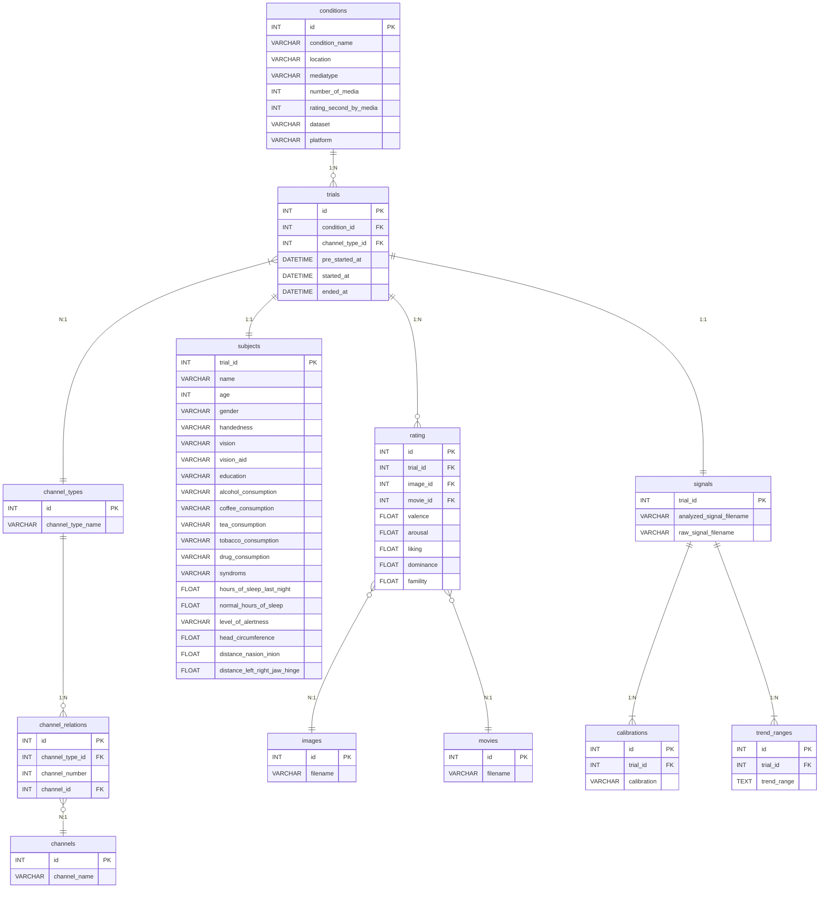

# MERS 　-Media Emotion Rating System-
<div align="center">
    
</div>

## 目次
1. [プロジェクトについて](#プロジェクトについて)
2. [使用技術](#使用技術)
3. [開発環境構築](#開発環境構築)
4. [使用方法](#使用方法)
5. [ER図](#ER図)


## プロジェクトについて

本アプリケーションは，被験者がメディアを視聴した時の感情を評価し，メディアと感情の関係性を分析するためのデータセットを作成する．


## 使用技術

Backend: 

Frontend: 

Database: 

Container: 

## 開発環境構築

### コード生成

1.コード生成のツールをインストールしていない場合

カスタムした openapi-generator となる jar ファイルを生成するため，以下の方法で maven をインストールする．

- MacOS：`brew install maven`
- その他の OS：https://maven.apache.org/install.html

また，生成した jar ファイルを実行してスキーマを生成するため，Java の実行環境を用意する．

- Java Download: https://www.java.com/ja/download/

2.コード生成のツールをインストールが完了している場合

以下のコードを実行することで，jar ファイルを生成する．
テストコードのコンパイルやテストの実行をスキップするように指定している．

```bash
make create-jar
```

以下のコードを実行することで，openapi-generator によりスキーマを生成する．
現状は，モデル，リクエスト，レスポンスの構造体のみを生成する．

```bash
make generate
```

### 依存関係のインストール

frontend のディレクトリで以下のコマンドを実行する．

```bash
npm install --frozen-lockfile
```

backend のディレクトリで以下のコマンドを実行する．

```bash
npm install --frozen-lockfile
```

## 使用方法
### アプリケーションの起動

MERS ディレクトリ直下で，以下のコマンドを実行して Docker コンテナのビルドと起動をする．

#### 本番環境

```bash
make build-up prod
```

起動後に`192.168.10.127:4000` にアクセスして実験を行う． 
本番環境の詳細な環境設定に関して，MERS Documentsを参考にすること．

#### 開発環境

```bash
make build-up dev
```

起動後に`http://localhost:4000` にアクセスして動作確認を行う．  


### アプリケーションの停止

MERS ディレクトリ直下で，以下のコマンドを実行して Docker コンテナの削除と停止をする．

#### 本番環境

```bash
make stop prod
```

#### 開発環境

```bash
make stop dev
```

## ER図

データベース構成を以下の図に示す．


