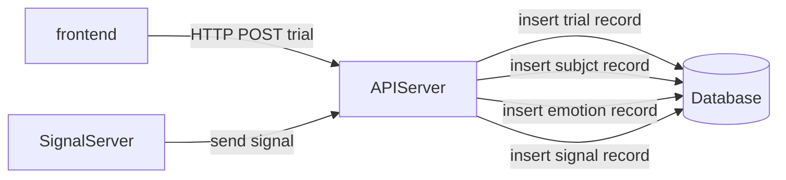

# MERS　-Media Emotion Rating System-
本アプリケーションは、被験者がメディアを視聴した時の感情を評価し、メディアと感情の関係性を分析するためのデータセットを作成する。

# 使用技術
### バックエンド：

### フロントエンド：

### データベース：

### コンテナ：

# システム構成
システム構成を以下の図に示す。

# 環境構築
## カスタムしたopenapi-generatorを生成するための準備
カスタムしたopenapi-generatorとなるjarファイルを生成するため、以下の方法でmavenをインストールする。
- MacOS：`brew install maven`  
- その他のOS：https://maven.apache.org/install.html

また、生成したjarファイルを実行してスキーマを生成するため、Javaの実行環境を用意する。  
- Java Download: https://www.java.com/ja/download/

## カスタムしたopenapi-generatorによるスキーマの生成
以下のコードを実行することで、jarファイルを生成する。
オプションは、テストコードのコンパイルやテストの実行をスキップするように指定している。  
`make create-jar`

以下のコードを実行することで、openapi-generatorによりスキーマを生成する。
現状は、モデル、リクエスト、レスポンスの構造体のみを生成する。  
`make generate`

# 開発
## Dockerコンテナの起動方法
MERSディレクトリ直下で以下のコマンドを実行する。
```bash
docker-compose up -d --build
```

## Dockerコンテナの停止方法
MERSディレクトリ直下で以下のコマンドを実行する。
```bash
docker-compose stop
```

## Dockerコンテナの停止および削除方法
MERSディレクトリ直下で以下のコマンドを実行する。
```bash
docker-compose down
```