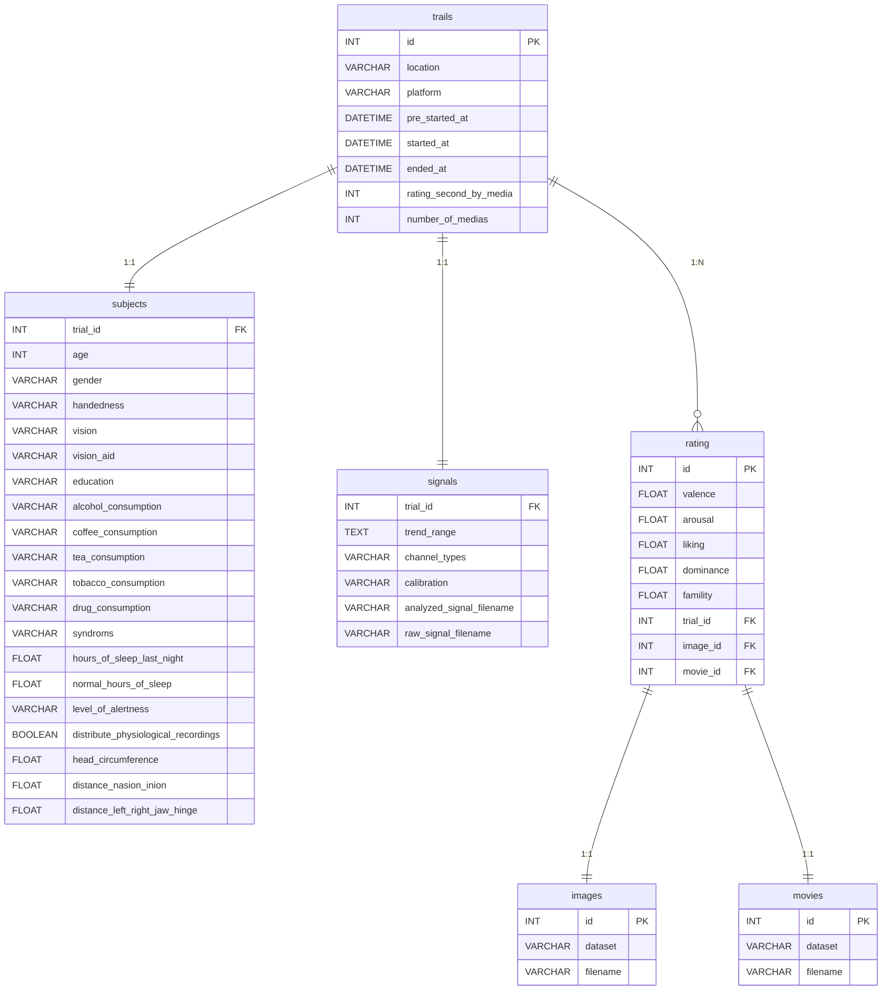

# ER図

```mermaid

---
title:"MERSデータベース"
---
erDiagram
    trails ||--|| subjects:"1:1"
    trails ||--|| signals:"1:1"
    rating ||--|| images:"1:1"
    rating ||--|| movies:"1:1"
    trails ||--o{ rating:"1:N"

    trails {
        INT id PK
        VARCHAR location
        VARCHAR platform
        DATETIME pre_started_at
        DATETIME started_at
        DATETIME ended_at
        INT rating_second_by_media
        INT number_of_medias
    }

    subjects {
        INT trial_id FK
        INT age
        VARCHAR gender
        VARCHAR handedness
        VARCHAR vision
        VARCHAR vision_aid
        VARCHAR education
        VARCHAR alcohol_consumption
        VARCHAR coffee_consumption
        VARCHAR tea_consumption
        VARCHAR tobacco_consumption
        VARCHAR drug_consumption
        VARCHAR syndroms
        FLOAT hours_of_sleep_last_night
        FLOAT normal_hours_of_sleep
        VARCHAR level_of_alertness
        BOOLEAN distribute_physiological_recordings
        FLOAT head_circumference
        FLOAT distance_nasion_inion
        FLOAT distance_left_right_jaw_hinge
    }

    signals {
        INT trial_id FK
        TEXT trend_range
        VARCHAR channel_types
        VARCHAR calibration
        VARCHAR analyzed_signal_filename
        VARCHAR raw_signal_filename
    }

    images {
        INT id PK
        VARCHAR dataset
        VARCHAR filename
    }

    movies {
        INT id PK
        VARCHAR dataset
        VARCHAR filename
    }

    rating {
        INT id PK
        FLOAT valence
        FLOAT arousal
        FLOAT liking
        FLOAT dominance
        FLOAT famility
        INT trial_id FK
        INT image_id FK
        INT movie_id FK
    }
```